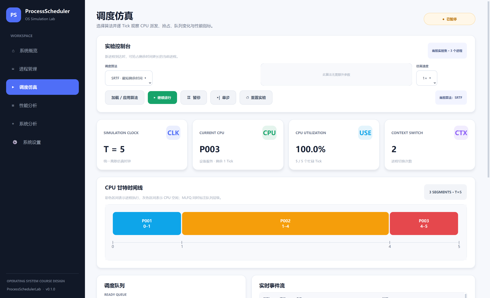
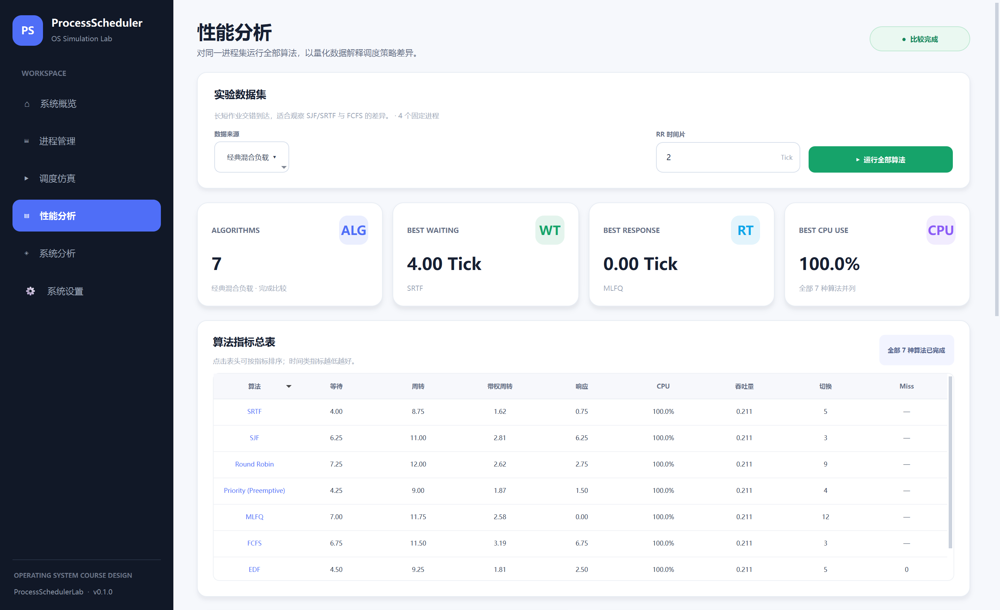
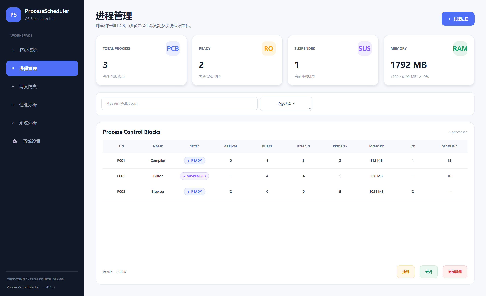
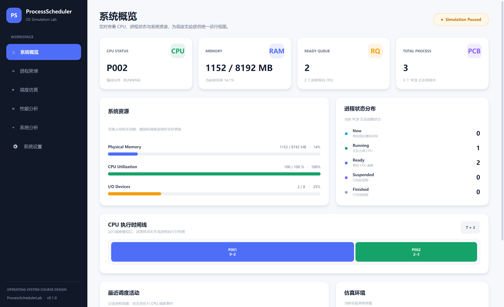
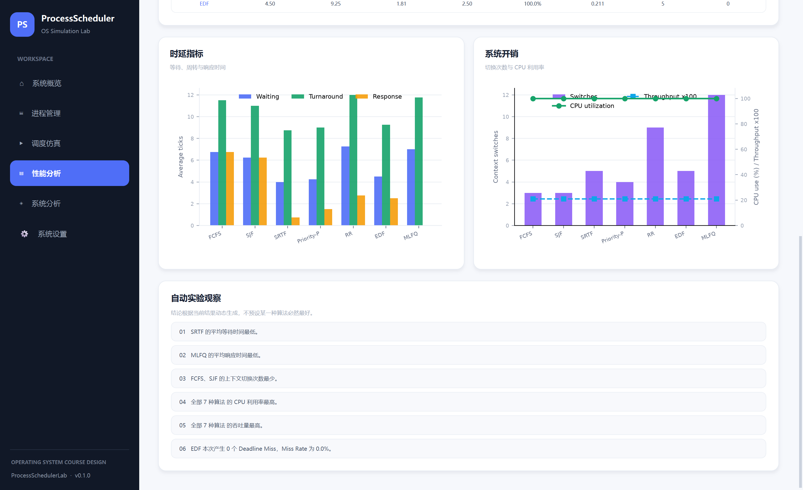

# ProcessSchedulerLab

[](https://github.com/Perfect-man888/ProcessSchedulerLab/actions/workflows/quality.yml)


一个基于 Python、PySide6 与 Matplotlib 的操作系统进程调度与资源管理可视化仿真平台。项目使用统一的离散 Tick 引擎联动展示 PCB 状态、CPU 调度、资源占用、就绪/阻塞队列、甘特图与性能指标，适用于操作系统课程设计、算法演示和可复现实验。

> 当前版本：`v1.1.0` · 推荐环境：Windows 10/11 + Python 3.11.9 · 最小窗口：1280 × 760

## 界面预览

| 调度仿真 | 性能分析 |
| --- | --- |
|  |  |

<details>
<summary>查看更多界面</summary>

### 进程与资源管理



### 系统运行概览



### 算法图表对比



</details>

## 核心功能

- **PCB 全生命周期管理**：创建、编辑、撤销、挂起、激活、搜索和状态筛选；编辑配置时自动保护并重置已有仿真进度。
- **资源事务管理**：对内存与 I/O 设备执行容量校验、原子分配和自动释放。
- **8 种调度算法**：FCFS、SJF、SRTF、Priority、Round Robin、EDF、RMS 和 MLFQ。
- **课程系统分类主路径**：批处理系统对应 FCFS/SJF/SRTF/Priority，分时系统对应 Round Robin/MLFQ，实时系统对应 EDF/RMS；切换系统类型时算法、说明、参数和重点指标同步更新。
- **逐 Tick 可视化**：支持开始、暂停、继续、单步、重置和多倍速运行。
- **真实状态联动**：同步更新当前 CPU、就绪队列、I/O 阻塞队列、PCB 指标、事件流与甘特图。
- **扩展调度行为**：支持抢占、Priority Aging、上下文切换开销、I/O 周期阻塞、MLFQ 降级与 Priority Boost。
- **批量性能实验**：在隔离副本上对同一数据集运行全部算法，并提供实验目的、推荐算法、核心指标、报告建议和可复制的自动结论。
- **多维指标分析**：统计等待、周转、带权周转、响应、CPU 利用率、吞吐率、切换次数、Makespan、Deadline Miss/违约率/满足率和 Jain 公平性指数。
- **RR 灵敏度扫描**：固定数据集扫描 Quantum 1–8，以 Response 40%、Turnaround 35%、Context Switch 25% 的透明 Min-Max 评分推荐当前负载下的折中时间片。
- **随机负载生成**：使用泊松到达、截断指数服务时间和固定随机种子生成可复现实验进程，可选周期性 I/O 阻塞及其间隔、持续时间。
- **完整导入导出**：支持 JSON 数据集、CSV 指标与进程明细、PNG 图表/甘特图以及多页 PDF 实验报告。
- **系统机制分析**：交互式对比 Windows、Linux、Android 与 iOS 的调度机制及其技术、经济原因。
- **可持久化设置**：配置总内存、I/O 设备数、默认时间片和仿真速度，并支持恢复示例数据或重置全部数据。

## 调度算法

| 算法 | 类型 | 调度方式 | 选择依据 | 适合观察 |
| --- | --- | --- | --- | --- |
| FCFS | 批处理 | 非抢占 | 到达顺序 | 简单公平、护航效应 |
| SJF | 批处理 | 非抢占 | 最短服务时间 | 平均等待时间优化 |
| SRTF | 批处理 | 抢占 | 最短剩余时间 | 新到短任务的快速响应 |
| Priority | 通用 | 可配置 | 优先级 + Aging | 优先级抢占与饥饿缓解 |
| Round Robin | 分时 | 时间片 | FIFO 轮转 | 响应性与切换开销权衡 |
| EDF | 实时 | 抢占 | 最早绝对截止时间 | Deadline Miss 分析 |
| RMS | 实时 | 抢占 | 最短周期优先 | 静态实时优先级策略 |
| MLFQ | 高级分时 | 抢占 | 多级反馈队列 | 交互任务与批处理任务兼顾 |

## 快速开始

### 1. 获取项目

```powershell
git clone https://github.com/Perfect-man888/ProcessSchedulerLab.git
cd ProcessSchedulerLab
```

### 2. 创建并启用虚拟环境

```powershell
py -3.11 -m venv .venv
.\.venv\Scripts\Activate.ps1
```

如果 PowerShell 禁止运行激活脚本，可以不激活环境，后续将 `python` 替换为 `.\.venv\Scripts\python.exe`。

### 3. 安装依赖

仅运行程序：

```powershell
python -m pip install --upgrade pip
python -m pip install -r requirements.txt
```

参与开发和运行测试：

```powershell
python -m pip install -r requirements-dev.txt
```

### 4. 启动程序

```powershell
python main.py
```

## 完成一次调度实验

1. 在“进程管理”中创建 PCB，或导入仓库提供的 [`综合验收测试数据.json`](datasets/综合验收测试数据.json)。
2. 进入“调度仿真”，先选择批处理、分时或实时系统，再选择该分类下的算法并填写必要参数，然后点击“加载 / 应用算法”。
3. 使用“开始运行”观察完整过程，或使用“单步”逐 Tick 检查 CPU 派发、抢占、阻塞和队列变化。
4. 进入“性能分析”，选择当前进程集或内置实验预设，运行全部算法并对比指标。
5. 根据需要导出 CSV、PNG 或 PDF，保存可复现的实验结果。

## 综合测试数据

仓库内置的 [`datasets/综合验收测试数据.json`](datasets/综合验收测试数据.json) 包含 8 个错峰到达的进程，覆盖长短作业、优先级抢占、Priority Aging、RR/MLFQ、Deadline/Period、I/O 阻塞和资源容量等场景，可直接用于功能验收和算法对比。

JSON 顶层结构：

```json
{
  "schema": "process-scheduler-lab.dataset",
  "version": 1,
  "processes": [
    {
      "pid": "P001",
      "name": "Kernel-Boot",
      "arrival_time": 0,
      "burst_time": 12,
      "priority": 4,
      "memory_mb": 2048,
      "io_devices": 1,
      "io_interval": 4,
      "io_duration": 2,
      "deadline": 26,
      "period": 16
    }
  ]
}
```

| 字段 | 含义 | 约束 |
| --- | --- | --- |
| `pid` / `name` | 进程标识与名称 | 非空；PID 在数据集中唯一 |
| `arrival_time` | 到达时间 | 大于等于 0 的整数 |
| `burst_time` | CPU 服务时间 | 大于等于 1 的整数 |
| `priority` | 静态优先级 | 大于等于 1；数值越小优先级越高 |
| `memory_mb` | 内存需求 | 大于等于 1，单位 MB |
| `io_devices` | I/O 设备需求 | 大于等于 0 |
| `io_interval` / `io_duration` | I/O 触发间隔与阻塞时长 | 必须同时为正整数或同时为 `null` |
| `deadline` | EDF 绝对截止时间 | 可为 `null`；填写时必须晚于到达时间 |
| `period` | RMS 周期元数据 | 可为 `null`；填写时为正整数 |

> 导入 JSON 会替换当前全部 PCB 并清空已有调度进度，导入前请先导出需要保留的数据。

## 实验口径与当前边界

- 当前使用**单 CPU、离散 Tick、单次作业**模型。
- 等待时间是进程处于 `READY` 状态的累计 Tick；周转时间为完成时刻减到达时刻。
- CPU 利用率为实际执行进程的 Tick 除以总 Tick；上下文切换开销计入利用率分母。
- I/O 阻塞期间进程释放 CPU，I/O 完成后重新进入就绪队列。
- `Period` 会随数据集保存并参与 RMS 优先级计算，但当前不会自动周期性释放新任务实例。
- EDF 对比要求数据集中的进程均填写合法 `deadline`，否则该算法会被跳过并给出提示。

## 导出结果

| 格式 | 内容 |
| --- | --- |
| JSON | 当前进程数据集与全部调度输入字段 |
| CSV | 含 Makespan 与实时满足率的算法指标总表，以及独立的逐进程指标明细 |
| PNG | CPU 甘特图、性能对比图表 |
| PDF | 实验参数、指标总表、自动结论、图表和逐进程明细 |

## 项目结构

```text
ProcessSchedulerLab/
├─ app/
│  ├─ models/       # PCB、仿真状态、调度分段和实验结果模型
│  ├─ schedulers/   # 统一调度器接口与 8 种算法实现
│  ├─ services/     # 进程、资源、仿真、实验、设置和导出服务
│  ├─ ui/           # 系统概览、进程、仿真、性能等页面
│  ├─ widgets/      # 甘特图、性能图表和通用 UI 组件
│  └─ styles/       # 全局主题与 QSS
├─ datasets/        # 可直接导入的 JSON 实验数据
├─ docs/            # 使用说明书与界面截图
├─ tests/           # 单元、集成和 UI 回归测试
├─ main.py          # 桌面应用入口
├─ requirements.txt
└─ requirements-dev.txt
```

## 测试与代码质量

运行全部回归测试：

```powershell
python -m pytest -q
```

运行静态检查和覆盖率门禁：

```powershell
python -m ruff check app tests main.py
python -m pytest --cov=app --cov-report=term-missing
```

当前共有 **246 项自动化测试**，覆盖数据模型、PCB 原子编辑、资源事务、全部调度算法、三类系统映射、实验说明 Profile、RR 折中推荐与边界情况、Priority Aging、MLFQ Boost、上下文切换、I/O 阻塞、随机负载、仿真状态机、后台批量实验、导入导出、PDF 报告、设置持久化及核心 UI 交互；项目要求语句与分支综合覆盖率不低于 90%。

无显示器环境下运行 Qt 测试：

```powershell
$env:QT_QPA_PLATFORM = "offscreen"
python -m pytest -q
```

GitHub Actions 会在 Windows + Python 3.11.9 环境中自动运行 Ruff、Pytest 和覆盖率检查。

## 常见问题

### 程序提示缺少 PySide6、Matplotlib 或 ReportLab

确认虚拟环境已启用，并重新执行：

```powershell
python -m pip install -r requirements.txt
```

### EDF 为什么没有参与批量对比？

EDF 需要所有进程都具有合法的绝对 `deadline`。可以直接导入综合验收数据，或在进程编辑界面补齐该字段。

### 为什么运行中不能修改 PCB 或系统容量？

这是为了保证同一次实验只有一个可信状态来源。请先暂停或重置仿真，再修改进程或设置。

### 窗口内容显示不完整怎么办？

建议使用 1280 × 760 或更高分辨率。页面主体支持滚动，队列会随可用宽度自动换行；若系统缩放比例较高，可适当放大窗口。

## 使用文档

更完整的安装、操作、实验、导出、排错与答辩演示说明，请查看：

- [`ProcessSchedulerLab_使用说明书.docx`](docs/ProcessSchedulerLab_使用说明书.docx)
- [`综合验收测试数据.json`](datasets/综合验收测试数据.json)

---

如果这个项目对你的操作系统学习或课程设计有帮助，欢迎点一个 Star。
